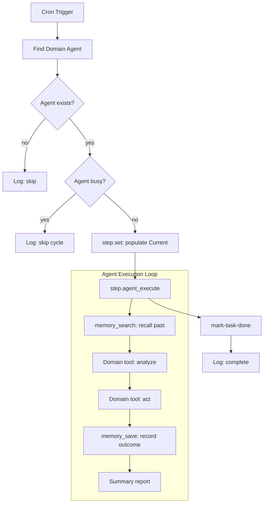

# Ratchet Multi-Domain Expansion Design

## Overview

Expand Ratchet from a single Operations use case (self-healing infrastructure) to three additional business domains: **Development**, **Security & Compliance**, and **Data & Analytics**. Each domain gets full pipeline support with new specialized tools, scripted test scenarios, and E2E validation scripts. The learning loop (memory-driven improvement across cycles) is a core priority, showcased most deeply in the Development domain with a 3-run progressive learning demonstration.

## Architecture

All three domains follow the same proven pattern from the Operations self-healing pipeline:

## Domain 1: Development — Code Review & Tech Debt

### New Tools

| Tool | Binary/Method | Input | Output |
|------|--------------|-------|--------|
| `code_review` | `golangci-lint run --out-format json` on target path | `path` (string), `config` (optional linter config) | `{findings: [{severity, file, line, message, linter}], count, passed}` |
| `code_complexity` | `gocyclo -over 10` + TODO/FIXME grep | `path` (string), `threshold` (int, default 10) | `{functions: [{name, file, complexity}], todos: [{file, line, text}], debt_score}` |
| `code_diff_review` | `git diff <base>..<head>` with structured parsing | `repo_path`, `base_ref`, `head_ref` | `{files: [{path, added, removed, hunks: [{header, content}]}], stats}` |

### Pipeline: `dev-review`

- **Trigger:** cron every 10 minutes
- **Agent:** DevReview (role: development)
- **Flow:** find agent → check not busy → step.set context → step.agent_execute → mark done

### Learning Loop (3-Run Progressive)

| Run | Agent Behavior | Memory Effect |
|-----|---------------|---------------|
| **Run 1: Discovery** | Reviews code, finds 3 issues. Searches memory → empty. Saves all 3 as new patterns. | 3 entries created |
| **Run 2: Recall** | Reviews similar code, finds 2 same types. Recalls patterns from Run 1. Reports "recurring pattern — high complexity in handlers seen previously." Reinforces pattern. | 1 updated, 1 new |
| **Run 3: Skip Known** | Finds same lint pattern again. Recalls pattern with count=2. Reports "Known recurring issue (3x) — recommending automated linting rule." Saves decision: "Automate golangci-lint for this pattern." | 1 decision entry |

### Scripted Scenarios

- `testdata/scenarios/dev-review-run1.yaml` — 5 turns: code_review → memory_search (empty) → code_complexity → memory_save ×3 → summary
- `testdata/scenarios/dev-review-run2.yaml` — 5 turns: code_review → memory_search (recalls) → code_complexity → memory_save (reinforce) → summary with past reference
- `testdata/scenarios/dev-review-run3.yaml` — 4 turns: code_review → memory_search (recalls reinforced) → memory_save (decision) → summary recommending automation

### E2E Test: `scripts/e2e-dev-review.sh`

1. Create temp Go file with known issues (high complexity function, lint violations, TODOs)
2. Start ratchet with `RATCHET_AI_PROVIDER=test RATCHET_AI_SCENARIO=testdata/scenarios/dev-review-run1.yaml`
3. Wait for dev-review pipeline → verify task completed, memory has entries
4. Restart with run2 scenario, fresh DB but seed memory entries from run1
5. Verify transcript references past findings
6. Restart with run3 scenario, seed memory with run1+run2 entries
7. Verify transcript contains "recurring" or "automate", memory has decision entry

### Skill: `dev-review`

System prompt guiding the agent to: review Go code for quality issues, identify recurring patterns, build knowledge base of common problems, and recommend automation for frequently-seen issues.

---

## Domain 2: Security & Compliance — Vulnerability Scanning

### New Tools

| Tool | Binary/Method | Input | Output |
|------|--------------|-------|--------|
| `security_scan` | Calls existing `SecurityAudit.RunAudit()` internals | (none — scans current platform) | `{findings: [{category, severity, passed, details}], score, passed_count, failed_count}` |
| `vuln_check` | `govulncheck ./...` with JSON output parsing | `module_path` (string) | `{vulnerabilities: [{id, package, severity, fixed_version, description}], count}` |

### Pipeline: `security-monitor`

- **Trigger:** cron every 30 minutes
- **Agent:** SecurityGuard (role: security)
- **Flow:** Same pattern as infra-monitor

### Scripted Scenario: `testdata/scenarios/security-scan.yaml`

5 turns: security_scan → vuln_check → memory_search (past vulns) → memory_save (new + status update) → summary with new/recurring/resolved breakdown

### E2E Test: `scripts/e2e-security-scan.sh`

1. Start ratchet with scripted provider
2. Wait for security-monitor pipeline
3. Verify: task completed, transcripts show security_scan + vuln_check + memory_save called

---

## Domain 3: Data & Analytics — Database Health

### New Tools

| Tool | Binary/Method | Input | Output |
|------|--------------|-------|--------|
| `db_analyze` | `EXPLAIN QUERY PLAN <sql>` via SQLite driver | `query` (string), `database` (string, default "ratchet-db") | `{plan: string, full_scan: bool, index_used: string, estimated_rows: int}` |
| `db_health_check` | SQLite pragmas: integrity_check, page_count, freelist_count, table_info | `database` (string, default "ratchet-db") | `{integrity: string, pages: int, free_pages: int, tables: [{name, row_count}], size_bytes: int}` |

### Pipeline: `data-monitor`

- **Trigger:** cron every 15 minutes
- **Agent:** DataAnalyst (role: data)
- **Flow:** Same pattern as infra-monitor

### Scripted Scenario: `testdata/scenarios/data-analysis.yaml`

5 turns: db_health_check → db_analyze (slow query) → memory_search (past optimizations) → memory_save (recommendation) → summary report

### E2E Test: `scripts/e2e-data-analysis.sh`

1. Start ratchet, insert test data for realistic DB state
2. Wait for data-monitor pipeline
3. Verify: task completed, transcripts show db_health_check + db_analyze + memory_save

---

## Cross-Cutting: Learning Loop Enhancement

### Infra-Monitor Memory Integration

Extend the existing self-healing pipeline to include:
- `memory_search` at the start of each health check (search for past incidents matching current findings)
- `memory_save` after remediation (record what was found, what action was taken, outcome)

Updated scenario: `self-healing-rollback-with-memory.yaml`
- Additional turns for memory_search (before action) and memory_save (after action)

### New Seeded Agents (modules.yaml)

| Agent ID | Name | Role | System Prompt Summary |
|----------|------|------|----------------------|
| devreview | DevReview | development | Review Go code, identify patterns, build knowledge base |
| securityguard | SecurityGuard | security | Continuous compliance monitoring, vulnerability tracking |
| dataanalyst | DataAnalyst | data | Database monitoring, query optimization, health reporting |

### New Triggers (triggers.yaml)

| Pipeline | Schedule | Purpose |
|----------|----------|---------|
| dev-review | `*/10 * * * *` | Code review every 10 minutes |
| security-monitor | `*/30 * * * *` | Security scan every 30 minutes |
| data-monitor | `*/15 * * * *` | Database health every 15 minutes |

---

## Artifact Summary

| Category | Count | Details |
|----------|-------|---------|
| New tools | 7 | code_review, code_complexity, code_diff_review, security_scan, vuln_check, db_analyze, db_health_check |
| New pipelines | 3 | dev-review, security-monitor, data-monitor |
| New pipeline configs | 3 | pipelines-dev.yaml, pipelines-security.yaml, pipelines-data.yaml |
| New scripted scenarios | 5 | dev-review-run1/2/3, security-scan, data-analysis |
| New E2E scripts | 3 | e2e-dev-review.sh, e2e-security-scan.sh, e2e-data-analysis.sh |
| New skills | 3 | dev-review, security-compliance, data-analytics |
| New seeded agents | 3 | DevReview, SecurityGuard, DataAnalyst |
| Enhanced scenarios | 1 | self-healing-rollback-with-memory.yaml |
| Enhanced pipeline | 1 | infra-monitor (memory integration) |
