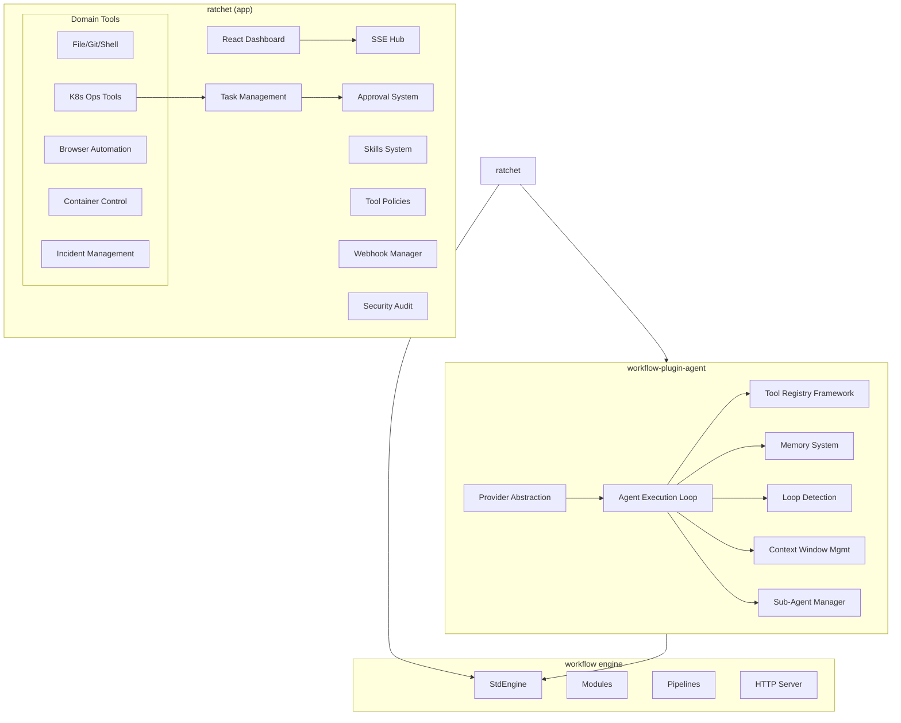

# Ratchet Evolution: Plugin Extraction + Agentic Platform Expansion

**Date**: 2026-03-04
**Status**: Approved

## Problem Statement

The current GoCodeAlone/ratchet repo is a fully-realized autonomous AI agent orchestration platform focused on development tasks (code review, git, shell, file ops). The business vision for Ratchet is much broader: "Agentic Automation That Never Stops Learning" — autonomous agents that observe, reason, act, and continuously improve across 7 business domains.

Two problems need solving:
1. **All AI agent intelligence is locked inside one app.** No other workflow app can use agent capabilities.
2. **The platform only supports dev-focused use cases.** The vision requires operations, customer experience, security, data, business ops, and R&D domains.

## Decision: Plugin + App Split

Extract generic AI agent primitives into `workflow-plugin-agent`. Keep `ratchet` as the flagship platform app that consumes the plugin and implements the expanded vision.

### What moves to `workflow-plugin-agent`

| Component | Current Location | Description |
|-----------|-----------------|-------------|
| AI Provider abstraction | `provider/` | Provider interface, Message model, ToolDef/ToolCall |
| Anthropic provider | `provider/anthropic.go` | Claude Messages API implementation |
| OpenAI provider | `provider/openai.go` | ChatGPT completions implementation |
| Mock provider | `provider/mock.go` | Scripted responses for testing |
| Test provider | `provider/test.go` | 3-mode test provider (scripted, channel, HTTP) |
| Agent execution loop | `ratchetplugin/step_agent_execute.go` | Autonomous observe→reason→act cycle |
| Tool registry framework | `ratchetplugin/tool_registry.go` | Tool registration API + execution |
| Memory system | `ratchetplugin/tools/tool_memory.go` | Semantic search, save, auto-extract |
| Loop detection | `ratchetplugin/step_agent_execute.go` | Circuit breakers for runaway agents |
| Context window mgmt | `ratchetplugin/context_*.go` | Token counting, compaction, summarization |
| Sub-agent spawning | `ratchetplugin/sub_agent_manager.go` | Ephemeral agent lifecycle |
| Provider registry | `ratchetplugin/provider_registry.go` | DB-backed provider lookup |
| Provider test step | `ratchetplugin/step_provider_test.go` | Test provider connectivity |
| Provider models step | `ratchetplugin/step_provider_models.go` | List available models |
| AI provider module | `ratchetplugin/module_ai_provider.go` | Module type for provider config |

**Plugin module types**: `agent.provider`, `agent.memory`, `agent.tool_registry`
**Plugin step types**: `step.agent_execute`, `step.provider_test`, `step.provider_models`, `step.memory_search`, `step.memory_save`

### What stays in `ratchet`

| Component | Description |
|-----------|-------------|
| Dashboard UI | React SPA with SSE real-time updates |
| SSE hub module | Server-Sent Events for live dashboard |
| Task management | Queue, assignment, status tracking, priorities |
| Approval system | Human-in-the-loop gates with auto-approve rules |
| Human request system | Request info/decisions from operators |
| Webhook manager | GitHub, Slack, JSON inbound triggers |
| Domain tools | file_read/write, git_*, shell_exec, browser_*, container_* |
| Skills system | Markdown skills with YAML frontmatter, agent assignment |
| Security audit | 12-check audit engine |
| Tool policy engine | Granular tool access control |
| All YAML configs | Routes, pipelines, modules, triggers |
| CLI (`ratchet`) | Command-line client |
| Server (`ratchetd`) | Server binary |

### Split principle

**If it's generic AI plumbing that any workflow app could use → plugin.**
**If it's Ratchet-specific UX, domain logic, or orchestration → app.**

## Phase 1: Extract `workflow-plugin-agent`

Create a new repo `GoCodeAlone/workflow-plugin-agent` following the established plugin pattern.

### Repo structure

```
workflow-plugin-agent/
├── plugin.go              # EnginePlugin: module types, step types, hook types
├── plugin.json            # Plugin metadata
├── go.mod
├── provider/
│   ├── provider.go        # Provider interface, Message, ToolDef, ToolCall
│   ├── anthropic.go       # Anthropic Claude implementation
│   ├── openai.go          # OpenAI implementation
│   ├── mock.go            # Mock provider (scripted)
│   └── test.go            # Test provider (scripted, channel, HTTP)
├── agent/
│   ├── agent.go           # Agent types (Status, Personality, Info)
│   ├── executor.go        # Autonomous execution loop
│   ├── loop_detector.go   # Circuit breakers
│   └── context.go         # Context window management + compaction
├── memory/
│   ├── memory.go          # Memory interface
│   ├── sqlite.go          # SQLite FTS5 + embeddings implementation
│   └── tools.go           # memory_search, memory_save tool definitions
├── tools/
│   ├── registry.go        # ToolRegistry: registration, lookup, execution
│   └── types.go           # ToolDef, ToolCall, ToolResult types
├── subagent/
│   └── manager.go         # Sub-agent spawning + lifecycle
├── modules/
│   ├── provider_module.go # agent.provider module type
│   └── memory_module.go   # agent.memory module type
├── steps/
│   ├── agent_execute.go   # step.agent_execute
│   ├── provider_test.go   # step.provider_test
│   └── provider_models.go # step.provider_models
├── .goreleaser.yml
└── .github/workflows/release.yml
```

### Plugin interface

The plugin exposes types that ratchet (or any workflow app) can import:

```go
// Any workflow app can register custom tools
type ToolRegistry interface {
    Register(name string, def ToolDef, handler ToolHandler)
    Execute(name string, params map[string]interface{}) (ToolResult, error)
    List() []ToolDef
}

// Any workflow app can use providers
type Provider interface {
    Chat(ctx context.Context, msgs []Message, tools []ToolDef) (*Response, error)
    Stream(ctx context.Context, msgs []Message, tools []ToolDef) (<-chan StreamEvent, error)
}

// Any workflow app can manage memory
type MemoryStore interface {
    Save(ctx context.Context, content string, category string, metadata map[string]string) error
    Search(ctx context.Context, query string, limit int) ([]MemoryEntry, error)
}
```

## Phase 2: Refactor Ratchet to Consume Plugin

Update ratchet's `go.mod` to import `workflow-plugin-agent`. Refactor `ratchetplugin/` to delegate to the plugin's types. Verify all existing functionality works unchanged.

Key changes:
- Remove duplicated provider code, import from plugin
- Remove agent execution loop code, import from plugin
- Remove memory system code, import from plugin
- Keep all ratchet-specific tools, UI, configs, approval system
- Register ratchet's domain tools (file, git, shell, browser, container) with the plugin's ToolRegistry

## Phase 3: Operations Use Case — Self-Healing Infrastructure

First expanded-vision use case. Adds capabilities for autonomous infrastructure management.

### New tools (registered in ratchet's tool registry)

| Tool | Description |
|------|-------------|
| `k8s_get_pods` | List pods with status, restarts, age |
| `k8s_get_events` | Cluster events (warnings, errors) |
| `k8s_get_metrics` | CPU/memory usage per pod/node |
| `k8s_get_logs` | Container logs with tail/since filters |
| `k8s_describe` | Describe resource (pod, deployment, service) |
| `k8s_restart_pod` | Delete pod to trigger restart |
| `k8s_scale` | Scale deployment replica count |
| `k8s_rollback` | Rollback deployment to previous revision |
| `k8s_apply` | Apply manifest (with approval gate) |
| `infra_health_check` | Aggregate health score across services |
| `incident_create` | Create incident record with severity |
| `incident_update` | Update incident status/timeline |
| `runbook_search` | Search runbooks for matching remediation |
| `runbook_update` | Update runbook with new learnings |

### New skills

**`self-healing-infrastructure`**: System prompt + instructions for the observe→detect→remediate→validate→learn cycle. Includes escalation rules, safety constraints (never delete PVCs, never scale to 0 in prod without approval).

**`deployment-orchestrator`**: Risk assessment, canary analysis, rollback decision-making, deployment window optimization.

### Workflow configs

New pipeline: `infra-monitor` triggered by cron schedule (every 60s):
1. `step.agent_execute` with self-healing skill
2. Agent uses k8s tools to check health
3. If anomaly detected → attempt remediation
4. If remediation fails → create incident + request human approval
5. Record outcome in memory for future learning

### Learning loop

The "continuously learning" differentiator:
- After each remediation (success or failure), agent saves outcome to memory
- Before each monitoring cycle, agent searches memory for similar past incidents
- Over time, the agent builds a knowledge base of what works for specific failure modes
- Runbooks are auto-updated with successful remediation patterns

## Phase 4: Testing Infrastructure

Three-layer testing approach:

### Layer 1: Simple mocks (unit/integration)
- Mock provider returns minimal responses
- Validates orchestration plumbing: task routing, SSE events, approval flow, tool dispatch
- Fast, deterministic, no AI reasoning simulated
- Lives in `workflow-scenarios` as standard API test scenarios

### Layer 2: Scripted scenarios (e2e)
- Mock provider replays realistic multi-turn tool call sequences
- Deterministic: same input always produces same output
- Tests full observe→reason→act loop with known outcomes
- Example: "pod CrashLoopBackOff → agent detects → restarts pod → validates health → records success"
- Uses the existing Test provider's scripted mode

### Layer 3: Operator mode (exploratory QA)
- Claude sub-agents act as "manual operators" interacting with the ratchet API
- Uses the existing Test provider's HTTP mode
- Sub-agents send tool call responses that exercise different paths
- Validates UI updates, SSE events, approval flows in real-time
- Run via agent team: QA lead coordinates multiple QA agents testing different scenarios

## Architecture Diagram



## Success Criteria

1. **Plugin extraction**: `workflow-plugin-agent` repo exists with CI, cross-platform binaries, and can be imported by any workflow app
2. **Ratchet refactored**: All existing functionality works unchanged after importing the plugin
3. **Ops use case**: Self-healing infra agent can detect pod failures, attempt remediation, escalate, and learn from outcomes
4. **Testing**: All three layers implemented with passing scenarios in `workflow-scenarios`
5. **Mock validation**: Scripted scenarios produce deterministic, reproducible test results
